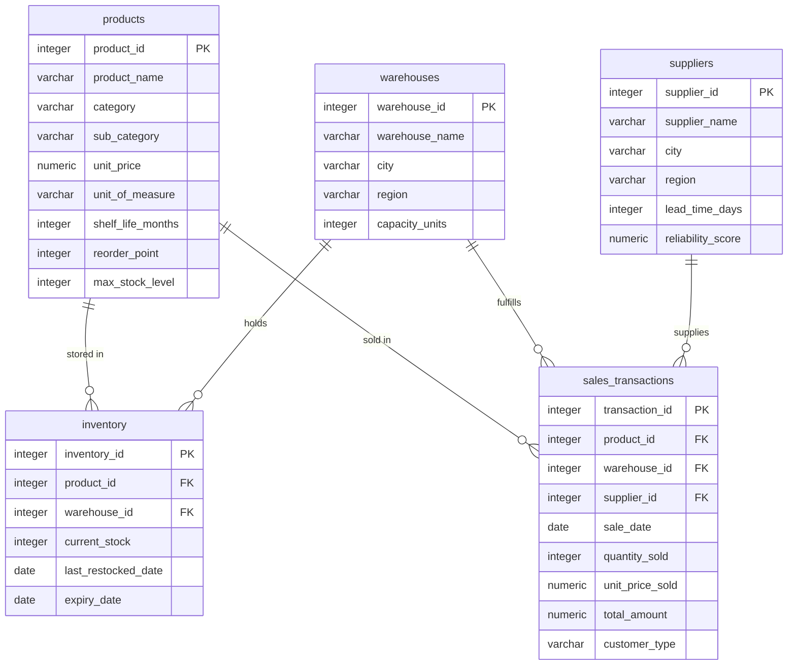
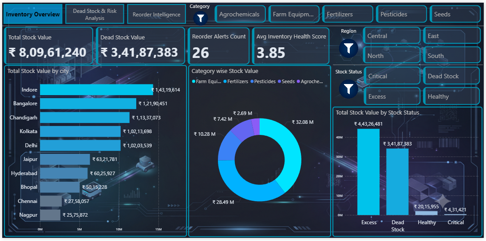
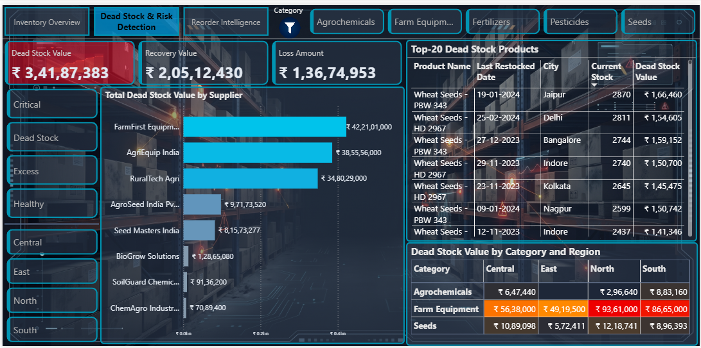
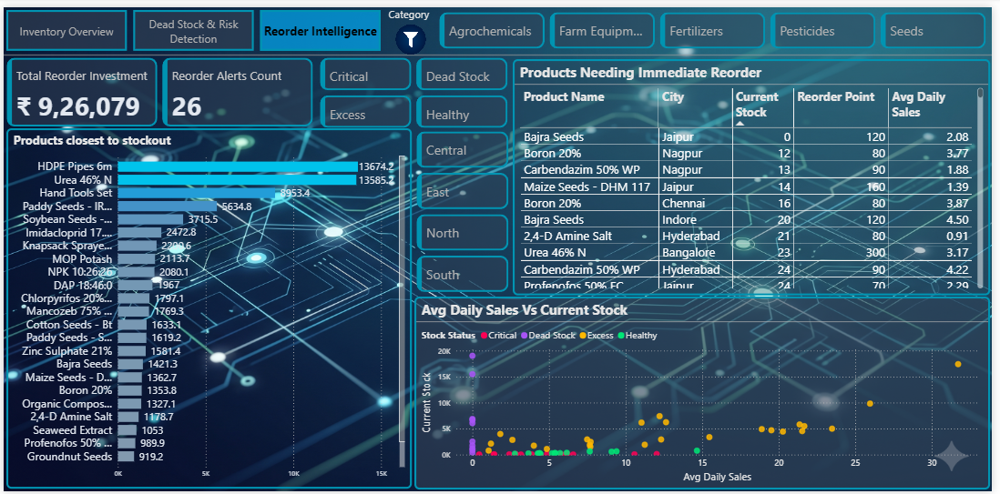

# **🌾Agri-Supply Inventory Intelligence**

## &#x09;(***Dead Stock Detection \& Reorder Optimization)***


### **📌 Project Overview**

An agricultural supply company managing seeds, fertilizers, pesticides, and farm equipment across multiple warehouses is losing lakhs annually due to dead stock, poor reorder timing, and seasonal demand mismatches. This project transforms raw PostgreSQL inventory data into an interactive Power BI dashboard that enables smarter stocking, inventory clearance, and timely reordering decisions.


### **🎯 Business Problem**

* **The Challenge**: The business had **₹3.4 Crores** of capital suffocating on warehouse shelves, misdiagnosed as a general "overstocking" issue rather than a targeted inventory allocation failure.
* **The Insight**: The company didn't have *too much stock*; it had *the wrong stock*. Capital was trapped in zero-velocity items while fast-moving inventory constantly risked stocking out.
* **The Solution**: Developed an automated risk-analysis and reorder intelligence system to pinpoint dead inventory by region and supplier, providing a clear roadmap to liquidate stagnant assets and reinvest in high-velocity products.


### 🛠️ Tech Stack


> Designed a 5-table relational database (products, warehouses, suppliers, inventory, sales) and wrote 20+ SQL queries — including CTEs and window functions to identify dead stock, reorder points, and supplier risk.

<br>


> Connected to PostgreSQL, engineered features (stock status, coverage days, health score, carrying cost), and validated results against SQL output before exporting for Power BI.

<br>


> Built a live-connected 3-page dashboard covering inventory overview, dead stock risk, and reorder intelligence.
> Built measures for dead stock value, reorder alerts, inventory health score, and total carrying cost.

<br>


> Managed version control, hosted the project on GitHub for collaboration and portfolio showcase.


---

### **🗄️ Database Schema**

Here is the Database Schema for my project (5 relational tables: products, warehouses, suppliers, inventory, sales_transactions):



### **📊 Dashboard Pages**

<details>

<summary><b>📈 Page 1 – Inventory Overview</b></summary>





</details>


<details>

<summary><b>📉 Page 2 – Dead Stock and Risk Analysis</b></summary>





</details>


<details>

<summary><b>📦 Page 3 – Reorder Intelligence</b></summary>





</details>

<br>

### **🔑 Top Insights**

* The "Wrong Stock" Problem: The company thought they simply bought "too much inventory." The data proved the real issue: they bought the wrong inventory. We had cash tied up in items that never sell, while popular items were constantly running out.
* The ₹3.4 Cr Cash Trap: I found that exactly ₹3.4 Crores is currently sitting on warehouse shelves as "Dead Stock" (meaning these items haven't had a single sale in the last 90 days).
* The 1-to-34 Risk Ratio: For every ₹1 stuck in dead stock, there is between ₹26 to ₹34 of potential revenue at risk because our fast-selling items are dangerously low on inventory.
* Rescuing Cash (Liquidation): If the company sells off the dead stock at a 40% discount just to clear warehouse space, they can immediately recover around ₹1.36 Crores in cash to reinvest.
* Spotting Problem Suppliers: The dashboard highlights exactly which suppliers are sending us the most dead stock. This gives the procurement team a clear list of who they need to call to renegotiate or cancel orders.
* Preventing Lost Sales: The Reorder Intelligence page flagged several high-demand products that had less than 3 days of inventory left, giving the team an exact checklist of what to buy today before they run out.
* Sales Speed vs. Stock Volume: The scatter plot proved a massive mismatch: our best-selling items were chronically under-stocked, while our worst-selling items were taking up the most physical warehouse space.
* Fixing Regional Imbalances: The data showed that some central warehouses were hoarding extra stock, while smaller regional branches were completely sold out of the exact same items.

<br>

### **💡 Key Recommendations**

* **Executive Summary**:

  * Currently, we have ₹3.4 Crores tied up in dead stock that is actively draining ₹1.1 Crores a year in warehouse storage fees. By selling this dead stock at a 40% discount, we will take a one-time loss but instantly recover ₹2.05 Crores in liquid cash. We can then use just a small fraction of that cash (₹23.3 Lakhs) to completely restock our critically low items, leaving the company with a massive net positive cash position of over ₹1.8 Crores.
* **Recommendation**:

  * I recommend we immediately liquidate the dead stock at the 40% discount to stop the ₹1.1 Crore annual storage bleed, and use the cash we get back to fully fund our critical inventory reorders today.

<br>

## 📂 Project Structure

```text
Agri-Supply-Inventory-Intelligence/
│
├── 📊 dashboard/
│   └── Agri_Inventory_Dashboard.pbix
│
├── 📁 data/
│   ├── agri_inventory_master_analysis.csv
│   ├── inventory.csv
│   ├── products.csv
│   ├── sales_transactions.csv
│   ├── suppliers.csv
│   └── warehouses.csv
│
├── 📓 jupyter_notebook/
│   ├── day_09_python_postgres_connection.ipynb
│   └── day_10_feature_engineering.ipynb
│
├── 🗄️ sql/
│   ├── day_01-02_data_preparation.sql
│   ├── day_03_data_verification.sql
│   ├── day_04_inventory_health.sql
│   ├── day_05_dead_stock_analysis.sql
│   ├── day_06_sales_velocity.sql
│   ├── day_07_reorder_intelligence.sql
│   └── day_08_financial_impact.sql
│
├── 🖼️ visuals/
│   ├── page01_inventory_overview.png
│   ├── page02_dead_stock_risk_analysis.png
│   ├── page03_reorder_intelligence.png
│   └── schema_diagram.png
│
└── 📄 README.md
```

<br>

### **👤 Author**

**ASIF KHAN | Data Analyst**

LinkedIn - https://www.linkedin.com/in/asif-khan-data-analyst/

Gmail - akhan749943@gmail.com

